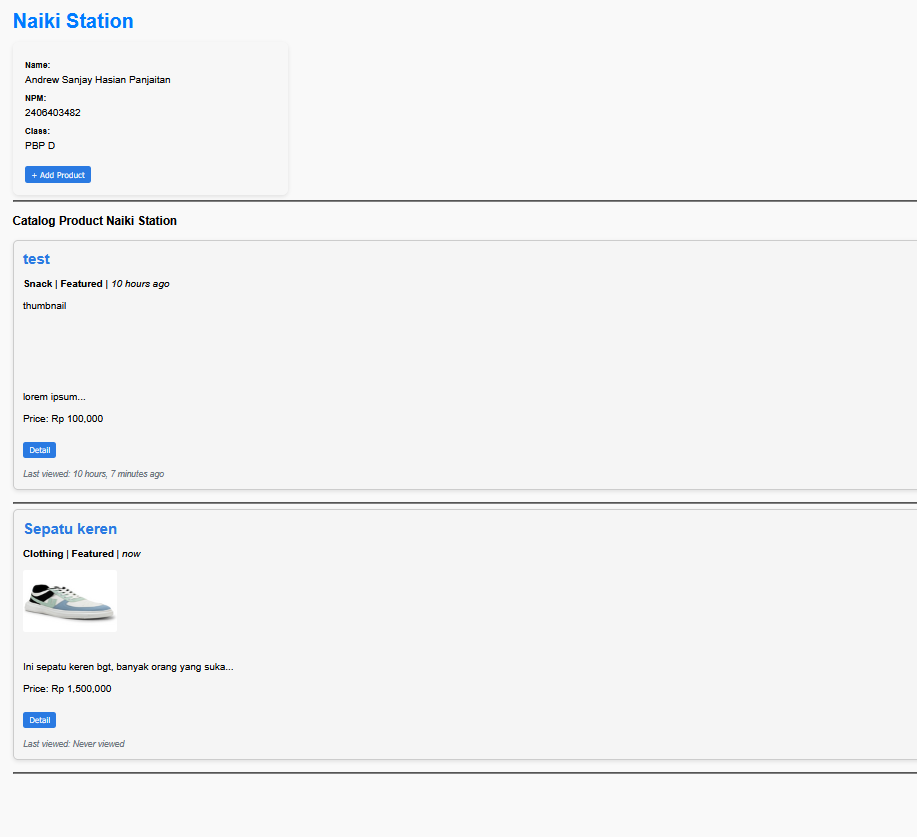
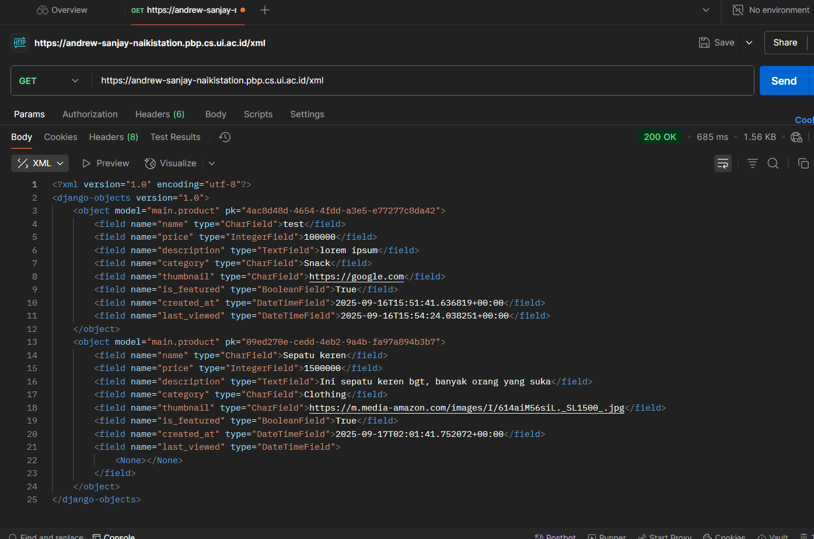
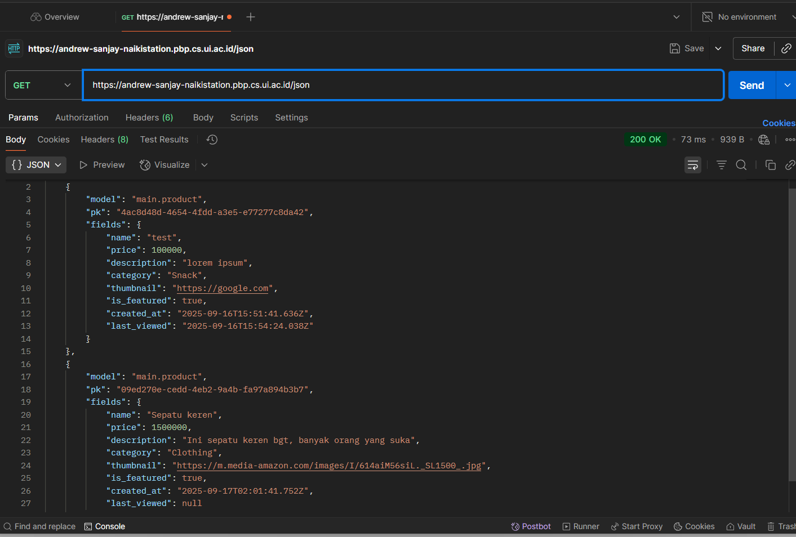
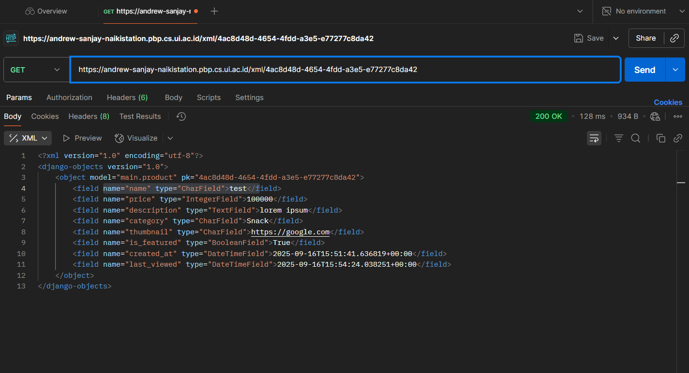
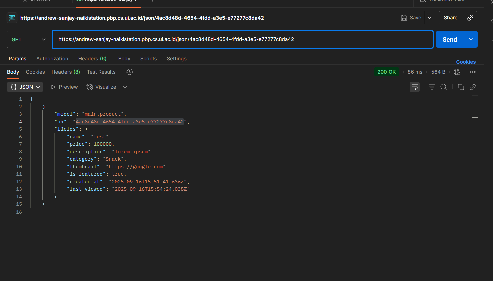

## Tautan Aplikasi PWS:
https://andrew-sanjay-naikistation.pbp.cs.ui.ac.id/


## Jawaban Pertanyaan
## Tugas 2
<details><summary>Jawaban</summary>
### 1. Jelaskan bagaimana cara kamu mengimplementasikan _checklist_ di atas secara _step-by-step_

Pertama, membuat proyek Django dengan menyiapkan nama direktori. Kemudian, saya buat virtual environtment dengan command di command prompt: `python -m venv env`. kemudian mengaktivasi env tersebut dengan command `venv/Scripts/activate`. setelah menyalakan venv, kita bisa menyiapkan dan menginstall dependencies. list dependencies yang dipakai disimpan di dalam file `requirements.txt`. kemudian install semua dependencies yang sudah disertakan dengan `pip install -r requirements.txt`. Setelah itu, buat proyek Django baru dengan nama Naiki-Station dengan perintah `django-admin startproject Naiki-Station`. 
Kedua, untuk menginstall aplikasi main, saya jalankan perintah `python manage.py startapp main`. Setelah direktori aplikasi/main terbentuk, kemudian saya daftarkan ke proyek dengan memasukkan 'main' ke list `INSTALLED_APPS`. 

kemudian, saya membuat model Product pada aplikasi main dengan membuka models.py di directori aplikasi main dan mengisi beberapa atribut, seperti `name`, `price`, `description`, `thumbnail`, `category`, `is_featured` dengan tipe masing-masing.

untuk membuat tampilan web, pertama saya buat folder templates di directory aplikasi main dan kemudian membuatt berkas baru bernama main.html dan ngisi berkas tersebut dengan 

```
<h1>Naiki Station</h1>
<h5>NPM: </h5>
<p>{{ npm }}</p>
<h5>Name: </h5>
<p>{{ name }}<p>
<h5>Class: </h5>
<p>{{ class }}</p>
```

kemudian memodifikasi file views.py di directory aplikasi. dengan memasukkan kode:

```
from django.shortcuts import render
def show_main(request):
    context = {
        'npm' : '2406403482',
        'name': 'Andrew Sanjay Hasian Panjaitan',
        'class': 'PBP D'
    }

    return render(request, "main.html", context)
```

dan terakhir di migrate dengan menggunakan `python manage.py migrate` setelah membuat migrasi model  dengan command `python manage.py makemigrations`

Untuk mengonfigurasi routing pada proyek agar dapat menjalankan aplikasi `main`, pertama membentuk berkas urls.py di direktori main, dengan isi kodenya:

```
from django.urls import path
from main.views import show_main

app_name = 'main'

urlpatterns = [
    path('', show_main, name='show_main'),
]

```

kemudian modifikasi berkas urls.py di directory proyek `Naiki-Station` dengan isi 


```
from django.contrib import admin
from django.urls import path, include

urlpatterns = [
    path('admin/', admin.site.urls),
    path('', include('main.urls')),  
]
```

Terakhir, untuk **deploy ke PWS**
saya pertama membuka website, pbp.cs.ui.ac.id. saya membuat project baru dan kasih nama `naikistation`. kemudian saya simpan username dan passwordnya. setelah create new project, saya ke environs dan mempaste isi file .env.prod. setelah itu ke direktori proyek dan membuka settings.py untuk menambahkan link web dari pws sebagai allowed_host. setelah itu kita tinggal melakukan step yang tertera di web pws.
dengan
```
git add. 
git remote add pws https://pbp.cs.ui.ac.id/andrew.sanjay/naikistation
git branch -M master
git push pws master
```

### 2. Buatlah bagan yang berisi _request client_ ke web aplikasi berbasis Django beserta responnya dan jelaskan pada bagan tersebut kaitan antara `urls.py`, `views.py`, `models.py`, dan berkas `html`.

![[t (2)(1).png]]

### 3. Jelaskan peran `settings.py` dalam proyek Django!
File **`settings.py`** dalam proyek Django berfungsi sebagai pusat konfigurasi yang mengatur bagaimana aplikasi berjalan. Di dalamnya terdapat berbagai pengaturan penting, seperti informasi database yang digunakan, daftar aplikasi yang aktif di proyek, lokasi template dan static files (HTML, CSS, JavaScript, gambar), hingga pengaturan keamanan seperti `SECRET_KEY`, `DEBUG`, dan `ALLOWED_HOSTS`.

### 4. Bagaimana cara kerja migrasi database di Django?
Ketika menjalankan `python manage.py migrate`, Django membaca file-file migrasi (.py) dari setiap app, membandingkannya dengan catatan migrasi yang sudah tersimpan di database (django_migrations), membuat rencana migrasi yang harus dijalankan, lalu mengeksekusi operasi-operasi (create table, add column, run Python, dll.) lewat schema editor database. Setiap migrasi yang sukses akan dicatat di tabel django_migrations. Jika migrasi dijalankan dalam transaksi (umumnya iya), kegagalan akan melakukan rollback

### 5. Menurut Anda, dari semua framework yang ada, mengapa framework Django dijadikan permulaan pembelajaran pengembangan perangkat lunak?
Menurut saya, Django dijadikan permulaan pembelajaran perangkat lunak karena dia based-of Python, yang dianggap sederhana, dan kelengkapan dari framework Django itu sendiri. Python sendiri punya sintaks yang sederhana dan mudah, sehingga pemula tidak tersandung di level bahasa sebelum masuk ke konsep besar pemrograman. Django dibangun di atas Python dan memanfaatkan sifat itu untuk memberikan pengalaman belajar yang lebih halus, sehingga mahasiswa bisa fokus memahami pola pikir _structured development_ seperti pemisahan logika, data, dan tampilan lewat arsitektur MTV, tanpa harus ribet membangun segalanya dari nol. Ditambah lagi, Django terkenal karena seperti “batteries included” dimana ORM, sistem migrasi database, autentikasi, admin panel, dan perlindungan keamanan dasar sudah included, yang langsung memperlihatkan kepada pemula bagaimana aplikasi nyata dikembangkan di industri. 

### 6.  Apakah ada feedback untuk asisten dosen tutorial 1 yang telah kamu kerjakan sebelumnya?
Menurutku, arahan, tutorial, dan asistensi oleh asisten dosen sudah sangat baik dan sangat lengkap jadi benar-benar membantu kami yang tidak paham apa-apa, jadi bisa lebih baik mendapatkan informasi dan paham akan materi terutama struktur dan cara kerja Django. Terima kasih kakak-kakak asdoss 🙏

</details>

## Tugas 3
1. **Jelaskan mengapa kita memerlukan _data delivery_ dalam pengimplementasian sebuah platform?**
   [jawaban]
   Menurut GeeksforGeeks, data delivery penting dalam sebuah platform karena memastikan data yang sudah diproses bisa sampai ke pengguna atau sistem lain untuk analisis, laporan, atau pemrosesan lebih lanjut. Tanpa data delivery yang baik, platform bisa kesulitan memberikan layanan real-time atau sinkronisasi data antar modul, sehingga pengalaman pengguna menurun. Selain itu, data delivery membantu menjaga keamanan dan integritas data dengan kontrol akses, enkripsi, dan audit trail. Singkatnya, data delivery mendukung operasional platform yang lancar dan memastikan keputusan berbasis data bisa dipercaya.
   
2. **Menurutmu, mana yang lebih baik antara XML dan JSON? Mengapa JSON lebih populer dibandingkan XML?**
   [jawaban]
   JSON lebih baik daripada XML karena memiliki sintaks yang lebih simple dan mudah dibaca, sehingga ukuran file lebih kecil dan proses parsing lebih cepat. JSON juga terintegrasi langsung dengan JavaScript, membuatnya mudah diproses di aplikasi web tanpa parser tambahan. Selain itu, JSON lebih efisien dalam transfer data dan didukung luas oleh API modern.
   JSON tetap menjadi pilihan utama dalam pengembangan aplikasi web dan mobile karena kesimplean nya, performa json yang lebih baik, dan lebih mudah untuk integrasi.
   
3. **Jelaskan fungsi dari method is_valid() pada form Django dan mengapa kita membutuhkan method tersebut?**
   [jawaban]
   Method `is_valid()` pada form Django berfungsi untuk memerika apakah data yang dimasukkan ke dalam form itu valid apa tidak, seperti tipe data, panjang maksimal, atau misal dari opsi yang sudah ditentukan. kita pakai method ini agar aplikasi dapat memastikan data yang diterima bersih, dan sesuai dengan aturan sebelum disimpan ke basis data atau diproses lebih lanjut.
   
4. **Mengapa kita membutuhkan `csrf_token` saat membuat form di Django? Apa yang dapat terjadi jika kita tidak menambahkan `csrf_token` pada form Django? Bagaimana hal tersebut dapat dimanfaatkan oleh penyerang?**
   [jawaban]
   `csrf_token` pas buat form di Django itu ada untuk mencegah serangan Cross-Site Request Forgery (CSRF). token ini berfungsi untuk memastikan bahwa permintaan yang dikirimkan ke server berasal dari user yang sah dan bukan pihak ketiga yang mencoba menyerang. jika ga ada, pihak ketiga tsb dapat membuat form atau request palsu yang sehingga dapat mengubah data atau menjalankan aksi yang dapat merugikan pengguna.
   
5. **Jelaskan bagaimana cara kamu mengimplementasikan _checklist_ di atas secara _step-by-step_ (bukan hanya sekadar mengikuti tutorial).**
   [jawaban]
	1. Tambahkan 4 fungsi `views` baru untuk melihat objek yang sudah ditambahkan dalam format XML, JSON, XML _by ID_, dan JSON _by ID_.
	   [--]
	   Menambahkan 2 function di `views.py` yang menunjukkan list product dalam format xml or json:
	   ```python
	   #return XML	
	   def show_xml(request):
	     Product_list = Product.objects.all()
	     xml_data = serializers.serialize("xml", Product_list)
	     return HttpResponse(xml_data, content_type="application/xml")
		```
		
		```python
	#return JSON
	def show_json(request):
	    Product_list = Product.objects.all()
	    json_data = serializers.serialize("json", Product_list)
	    return HttpResponse(json_data, content_type="application/json")
	    ```
	    
	    Menambahkan 2 function di views.py yang menunjukkan masing-masing data product based of product id masing-masing product:
```python
	 #Show XML
def show_xml_by_id(request, product_id):
   try:
       product_item = Product.objects.filter(pk=product_id)
       xml_data = serializers.serialize("xml", product_item)
       return HttpResponse(xml_data, content_type="application/xml")
   except Product.DoesNotExist:
       return HttpResponse(status=404)
```
  
```python
#SHOW JSON
def show_json_by_id(request, product_id):
   try:
       product_item = Product.objects.get(pk=product_id)
       json_data = serializers.serialize("json", [product_item])
       return HttpResponse(json_data, content_type="application/json")
   except Product.DoesNotExist:
       return HttpResponse(status=404)
```

5. lanjut --
	2. Membuat routing URL untuk masing-masing `views` yang telah ditambahkan pada poin 1
	   [--]
	   setting url agar bisa di akses di browser dengan membuka `urls.py`
	   pertama, import ke empat function dari views.py dengan 
	   ```python
	   from main.views import show_main, show_xml, show_json, show_xml_by_id, show_json_by_id
	   ```
	   terus, menambahkan path di urlpatterns:
	```python
	   urlpatterns = [
		   ...
		   path('xml/', show_xml, name='show_xml'),
		   path('json/', show_json, name='show_json'),
		   path('xml/<str:product_id>/', show_xml_by_id, name='show_xml_by_id'),
		   path('json/<str:product_id>/', show_json_by_id, name='show_json_by_id'),
		   ...
		   ]
		   ```
	3. Membuat halaman yang menampilkan data objek model yang memiliki tombol "Add" yang akan redirect ke halaman `form`, serta tombol "Detail" pada setiap data objek model yang akan menampilkan halaman detail objek.
	   [--]
	   pertama reformat templates dari yang sebelumnya hanya `main.html` menjadi template utama - `base.html` yang terletak di folder templates di `root directory`, yang berlaku sebagai template utama dimana bodynya bisa digunakan untuk page html berbeda-beda namun tetap menyimpan konfigurasi yang sama, seperti css. kemudian menambahkan 2 file `.html` di `app directory` untuk menampilkan form dan detail product.
	   
	   pertama di `base.html` di `root directory` di isi:
	   
	   ```html
<!DOCTYPE html>

<html lang="en">
<head>
    <meta charset="UTF-8" />
    <meta name="viewport" content="width=device-width, initial-scale=1.0" />
     
</head>
<body>
     
</body>
</html>
```
	   di `base.html` terdapat seperti `` disini adalah tempat dimana akan ditukar dengan html per  page. or simply ini adalah untuk logic
	   
	   Kemudian,
	   di `main.html` ditambahkan:
	   ```html
	   
	   
	   <!-- isi file tetap sama -->
	   
	   <!-- lokasi button tepat dibawah nama, npm, kelas -->
	    <a href="">
	    <button>+ Add Product</button> </a>
	    
	   <!-- isi file tetap sama -->
	   
	   <!-- menampilkan tiap product yang telah ditambahkan -->
	   
	   
	   <!-- isi display product dibebaskan -->
	   
	   <!-- lokasi detail berada di paling bawah tiap product block -->
	   <a href="">
	   <button>Detail</button> </a>
	   
	   
	   
	   ```
	   
	  kemudian di `product_detail.html` kita tambahkan:
	  ```html
	  
	  <!-- agar beberapa tampilan lebih enak dibaca -->
	   	   
	  
	  <!-- button untuk kembali ke main page -->
	  <p><a href="">
	  <button>← Back to Product List</button></a></p>
	  
	  <!-- container untuk menampilkan product -->
	  <div>
	  <!-- nama product -->
	  <h2>
	  <a href="">{{ product.name }}</a>
	  </h2>
	  
	  <!-- detail product -->
	  <p>
	  <b>{{ product.get_category_display }}</b>
	   | <b>Featured</b>
	  | <i>{{ product.created_at|naturaltime }}</i>
	  </p>
	  
	  <!-- thumbnail -->
	  
	  
	  <br />
	  
	  
	  <!-- deskripsi dan price -->
	  <p>{{ product.description|truncatewords:25 }}...</p>
	  <p>Price: Rp {{ product.price|intcomma }}</p>
	  
	  ```
	  
	  kemudian di `create_product.html` kita isi:
	  ```html
	  
	  
	  
	  <h1>Add Product</h1>
	  <form method="POST">
		  
		  <table>
			  {{ form.as_table }}
			  <tr>
				  <td></td>
				  <td>
					  <input type="submit" value="Add Product" />
				  </td>
			  </tr>
		  </table>
	  </form>
	  
	  ```
	  
	  Setelah menyelesaikan bagian tampilan di html kita sekarang perlu menghubungkan semuanya agar bisa digunakan dan diakses. pertama-tama saya membuat file baru `forms.py` di directory apps `main` dengan isi disesuaikan dengan atribut apa saja yang bisa di input oleh user, misalnya:
	  ```python
	  from django.forms import ModelForm
	  from main.models import Product
	  
	  class ProductForm(ModelForm):
		  class Meta:
			  model = Product
			  fields = ["name", 
			  "price", 
			  "description", 
			  "category", 
			  "thumbnail",
			  "is_featured"]
	  ```
	  dengan masing-masing elemen dalam fields adalah atribut yang terdapat di dalam `models.py`. kemudian saya koneksikan forms ini ke fungsi `create_product` di views.py sekalian dengan `product_details` :
	  ```python views.py
	  from .models import Product
	  from django.shortcuts import render, redirect, get_object_or_404
	  from main.forms import ProductForm
	  ...
	  def show_main(request):
		  Product_list = Product.objects.all()
		  context = {
			  ...
			  'Product_list': Product_list
			  ...
		  }
	  return render(request, "main.html", context)
	  
	  #menghubungkan dengan form dan create_product.html
	  def create_product(request):
		  form = ProductForm(request.POST or None)
		  if form.is_valid():
			  form.save()
			  return redirect('main:show_main')
		  
		  context = {'form': form}
		  return render(request, 'create_product.html', context)  
	  
	  #menampilkan detail tiap product
	  def show_product(request, product_id):
		  product = get_object_or_404(Product, pk=product_id)
		  context = {'product': product}
		  product.last_viewed = timezone.now()
		  product.save(update_fields=["last_viewed"])  
	  return render(request, 'product_detail.html', context)
	  
	  ...
	  ```
	  
	  Selebihnya saya melakukan styling tipis-tipis dengan css yang ditaruh di head di `base.html`

6. Mengakses keempat URL di poin 2 menggunakan Postman, membuat _screenshot_ dari hasil akses URL pada Postman, dan menambahkannya ke dalam `README.md`.
   
   [tampilan web - 2 produk]
   
   tampilan XML dan JSON
   [tampilan XML]
   
   [tampilan JSON]
   
   
   Tampilan XML_by_id dan JSON_by_id
   [tampilan XML_by_id]
   
   [tampilan JSON_by_id]
   