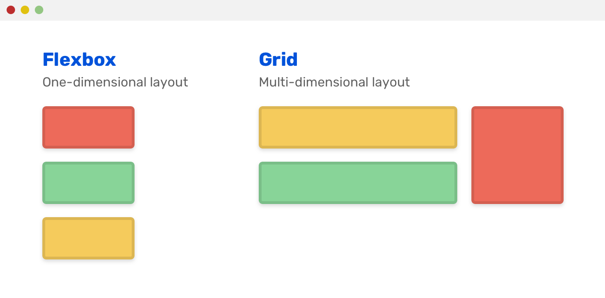

---

## Tautan Aplikasi PWS:
https://andrew-sanjay-naikistation.pbp.cs.ui.ac.id/

## Jawaban Pertanyaan

# Tugas 2
<details>
<summary>Jawaban</summary>

### 1. Jelaskan bagaimana cara kamu mengimplementasikan _checklist_ di atas secara _step-by-step_

Pertama, membuat proyek Django dengan menyiapkan nama direktori. Kemudian, saya buat virtual environtment dengan command di command prompt: `python -m venv env`. kemudian mengaktivasi env tersebut dengan command `venv/Scripts/activate`. setelah menyalakan venv, kita bisa menyiapkan dan menginstall dependencies. list dependencies yang dipakai disimpan di dalam file `requirements.txt`. kemudian install semua dependencies yang sudah disertakan dengan `pip install -r requirements.txt`. Setelah itu, buat proyek Django baru dengan nama Naiki-Station dengan perintah `django-admin startproject Naiki-Station`. 

Kedua, untuk menginstall aplikasi main, saya jalankan perintah `python manage.py startapp main`. Setelah direktori aplikasi/main terbentuk, kemudian saya daftarkan ke proyek dengan memasukkan 'main' ke list `INSTALLED_APPS`. 

Kemudian, saya membuat model Product pada aplikasi main dengan membuka models.py di directori aplikasi main dan mengisi beberapa atribut, seperti `name`, `price`, `description`, `thumbnail`, `category`, `is_featured` dengan tipe masing-masing.

Untuk membuat tampilan web, pertama saya buat folder templates di directory aplikasi main dan kemudian membuatt berkas baru bernama main.html dan ngisi berkas tersebut dengan:

```html
<h1>Naiki Station</h1>
<h5>NPM: </h5>
<p>{{ npm }}</p>
<h5>Name: </h5>
<p>{{ name }}</p>
<h5>Class: </h5>
<p>{{ class }}</p>
```

Kemudian memodifikasi file views.py di directory aplikasi dengan memasukkan kode:

```python
from django.shortcuts import render

def show_main(request):
    context = {
        'npm' : '2406403482',
        'name': 'Andrew Sanjay Hasian Panjaitan',
        'class': 'PBP D'
    }
    return render(request, "main.html", context)
```

Dan terakhir di migrate dengan menggunakan `python manage.py migrate` setelah membuat migrasi model  dengan command `python manage.py makemigrations`.

Untuk mengonfigurasi routing pada proyek agar dapat menjalankan aplikasi `main`, pertama membentuk berkas urls.py di direktori main, dengan isi kodenya:

```python
from django.urls import path
from main.views import show_main

app_name = 'main'

urlpatterns = [
    path('', show_main, name='show_main'),
]
```

Kemudian modifikasi berkas urls.py di directory proyek `Naiki-Station` dengan isi:

```python
from django.contrib import admin
from django.urls import path, include

urlpatterns = [
    path('admin/', admin.site.urls),
    path('', include('main.urls')),  
]
```

Terakhir, untuk **deploy ke PWS**, saya pertama membuka website pbp.cs.ui.ac.id. Saya membuat project baru dan kasih nama `naikistation`. Kemudian saya simpan username dan passwordnya. Setelah create new project, saya ke environs dan mempaste isi file .env.prod. Setelah itu ke direktori proyek dan membuka settings.py untuk menambahkan link web dari PWS sebagai allowed\_host. Setelah itu tinggal melakukan step yang tertera di web PWS:

```bash
git add .
git remote add pws https://pbp.cs.ui.ac.id/andrew.sanjay/naikistation
git branch -M master
git push pws master
```

### 2. Buatlah bagan yang berisi *request client* ke web aplikasi berbasis Django beserta responnya dan jelaskan pada bagan tersebut kaitan antara `urls.py`, `views.py`, `models.py`, dan berkas `html`.


### 3. Jelaskan peran `settings.py` dalam proyek Django!

File **`settings.py`** dalam proyek Django berfungsi sebagai pusat konfigurasi yang mengatur bagaimana aplikasi berjalan. Di dalamnya terdapat berbagai pengaturan penting, seperti informasi database yang digunakan, daftar aplikasi yang aktif di proyek, lokasi template dan static files (HTML, CSS, JavaScript, gambar), hingga pengaturan keamanan seperti `SECRET_KEY`, `DEBUG`, dan `ALLOWED_HOSTS`.

### 4. Bagaimana cara kerja migrasi database di Django?

Ketika menjalankan `python manage.py migrate`, Django membaca file-file migrasi (.py) dari setiap app, membandingkannya dengan catatan migrasi yang sudah tersimpan di database (django\_migrations), membuat rencana migrasi yang harus dijalankan, lalu mengeksekusi operasi-operasi (create table, add column, run Python, dll.) lewat schema editor database. Setiap migrasi yang sukses akan dicatat di tabel django\_migrations. Jika migrasi dijalankan dalam transaksi (umumnya iya), kegagalan akan melakukan rollback.

### 5. Menurut Anda, dari semua framework yang ada, mengapa framework Django dijadikan permulaan pembelajaran pengembangan perangkat lunak?

Menurut saya, Django dijadikan permulaan pembelajaran perangkat lunak karena dia based-of Python, yang dianggap sederhana, dan kelengkapan dari framework Django itu sendiri. Python sendiri punya sintaks yang sederhana dan mudah, sehingga pemula tidak tersandung di level bahasa sebelum masuk ke konsep besar pemrograman. Django dibangun di atas Python dan memanfaatkan sifat itu untuk memberikan pengalaman belajar yang lebih halus, sehingga mahasiswa bisa fokus memahami pola pikir *structured development* seperti pemisahan logika, data, dan tampilan lewat arsitektur MTV, tanpa harus ribet membangun segalanya dari nol. Ditambah lagi, Django terkenal karena seperti “batteries included” dimana ORM, sistem migrasi database, autentikasi, admin panel, dan perlindungan keamanan dasar sudah included, yang langsung memperlihatkan kepada pemula bagaimana aplikasi nyata dikembangkan di industri.

### 6.  Apakah ada feedback untuk asisten dosen tutorial 1 yang telah kamu kerjakan sebelumnya?

Menurutku, arahan, tutorial, dan asistensi oleh asisten dosen sudah sangat baik dan sangat lengkap jadi benar-benar membantu kami yang tidak paham apa-apa, jadi bisa lebih baik mendapatkan informasi dan paham akan materi terutama struktur dan cara kerja Django. Terima kasih kakak-kakak asdoss 🙏

</details>

# Tugas 3
<details>
<summary>Jawaban</summary>
1. **Jelaskan mengapa kita memerlukan *data delivery* dalam pengimplementasian sebuah platform?**

Menurut GeeksforGeeks, data delivery penting dalam sebuah platform karena memastikan data yang sudah diproses bisa sampai ke pengguna atau sistem lain untuk analisis, laporan, atau pemrosesan lebih lanjut. Tanpa data delivery yang baik, platform bisa kesulitan memberikan layanan real-time atau sinkronisasi data antar modul, sehingga pengalaman pengguna menurun. Selain itu, data delivery membantu menjaga keamanan dan integritas data dengan kontrol akses, enkripsi, dan audit trail. Singkatnya, data delivery mendukung operasional platform yang lancar dan memastikan keputusan berbasis data bisa dipercaya.

2. **Menurutmu, mana yang lebih baik antara XML dan JSON? Mengapa JSON lebih populer dibandingkan XML?**

JSON lebih baik daripada XML karena memiliki sintaks yang lebih simple dan mudah dibaca, sehingga ukuran file lebih kecil dan proses parsing lebih cepat. JSON juga terintegrasi langsung dengan JavaScript, membuatnya mudah diproses di aplikasi web tanpa parser tambahan. Selain itu, JSON lebih efisien dalam transfer data dan didukung luas oleh API modern. JSON tetap menjadi pilihan utama dalam pengembangan aplikasi web dan mobile karena kesimplean nya, performa json yang lebih baik, dan lebih mudah untuk integrasi.

3. **Jelaskan fungsi dari method is\_valid() pada form Django dan mengapa kita membutuhkan method tersebut?**

Method `is_valid()` pada form Django berfungsi untuk memerika apakah data yang dimasukkan ke dalam form itu valid apa tidak, seperti tipe data, panjang maksimal, atau misal dari opsi yang sudah ditentukan. Kita pakai method ini agar aplikasi dapat memastikan data yang diterima bersih, dan sesuai dengan aturan sebelum disimpan ke basis data atau diproses lebih lanjut.

4. **Mengapa kita membutuhkan `csrf_token` saat membuat form di Django? Apa yang dapat terjadi jika kita tidak menambahkan `csrf_token` pada form Django? Bagaimana hal tersebut dapat dimanfaatkan oleh penyerang?**

`csrf_token` pas buat form di Django itu ada untuk mencegah serangan Cross-Site Request Forgery (CSRF). Token ini berfungsi untuk memastikan bahwa permintaan yang dikirimkan ke server berasal dari user yang sah dan bukan pihak ketiga yang mencoba menyerang. Jika ga ada, pihak ketiga tsb dapat membuat form atau request palsu yang sehingga dapat mengubah data atau menjalankan aksi yang dapat merugikan pengguna.

5. **Jelaskan bagaimana cara kamu mengimplementasikan *checklist* di atas secara *step-by-step* (bukan hanya sekadar mengikuti tutorial).**

6. Tambahkan 4 fungsi `views` baru untuk melihat objek yang sudah ditambahkan dalam format XML, JSON, XML *by ID*, dan JSON *by ID*.

Menambahkan 2 function di `views.py` yang menunjukkan list product dalam format xml or json:

```python
# return XML
def show_xml(request):
    Product_list = Product.objects.all()
    xml_data = serializers.serialize("xml", Product_list)
    return HttpResponse(xml_data, content_type="application/xml")
```

```python
# return JSON
def show_json(request):
    Product_list = Product.objects.all()
    json_data = serializers.serialize("json", Product_list)
    return HttpResponse(json_data, content_type="application/json")
```

Menambahkan 2 function di views.py yang menunjukkan masing-masing data product based of product id masing-masing product:

```python
# Show XML by ID
def show_xml_by_id(request, product_id):
    try:
        product_item = Product.objects.filter(pk=product_id)
        xml_data = serializers.serialize("xml", product_item)
        return HttpResponse(xml_data, content_type="application/xml")
    except Product.DoesNotExist:
        return HttpResponse(status=404)
```

```python
# Show JSON by ID
def show_json_by_id(request, product_id):
    try:
        product_item = Product.objects.get(pk=product_id)
        json_data = serializers.serialize("json", [product_item])
        return HttpResponse(json_data, content_type="application/json")
    except Product.DoesNotExist:
        return HttpResponse(status=404)
```

2. Membuat routing URL untuk masing-masing `views` yang telah ditambahkan:

```python
from main.views import show_main, show_xml, show_json, show_xml_by_id, show_json_by_id

urlpatterns = [
    ...
    path('xml/', show_xml, name='show_xml'),
    path('json/', show_json, name='show_json'),
    path('xml/<str:product_id>/', show_xml_by_id, name='show_xml_by_id'),
    path('json/<str:product_id>/', show_json_by_id, name='show_json_by_id'),
    ...
]
```

3. Membuat halaman yang menampilkan data objek model yang memiliki tombol "Add" yang akan redirect ke halaman `form`, serta tombol "Detail" pada setiap data objek model.

Pertama reformat templates dari yang sebelumnya hanya `main.html` menjadi template utama `base.html` di folder `templates` root directory:

```html

<!DOCTYPE html>
<html lang="en">
<head>
    <meta charset="UTF-8" />
    <meta name="viewport" content="width=device-width, initial-scale=1.0" />
     
</head>
<body>
     
</body>
</html>
```

Di `main.html`:

```html


<!-- isi file tetap sama -->

<a href="">
    <button>+ Add Product</button>
</a>


    <a href="">
        <button>Detail</button>
    </a>


```

Di `product_detail.html`:

```html



<p><a href=""><button>← Back to Product List</button></a></p>

<div>
    <h2><a href="">{{ product.name }}</a></h2>
    <p><b>{{ product.get_category_display }}</b> | <b>Featured</b> | <i>{{ product.created_at|naturaltime }}</i></p>
    
        <br />
    
    <p>{{ product.description|truncatewords:25 }}...</p>
    <p>Price: Rp {{ product.price|intcomma }}</p>

```

Di `create_product.html`:

```html


<h1>Add Product</h1>
<form method="POST">
    
    <table>
        {{ form.as_table }}
        <tr>
            <td></td>
            <td><input type="submit" value="Add Product" /></td>
        </tr>
    </table>
</form>

```

Forms (`forms.py`):

```python
from django.forms import ModelForm
from main.models import Product

class ProductForm(ModelForm):
    class Meta:
        model = Product
        fields = ["name", "price", "description", "category", "thumbnail", "is_featured"]
```

Views (`views.py`):

```python
from .models import Product
from django.shortcuts import render, redirect, get_object_or_404
from main.forms import ProductForm
from django.utils import timezone

def show_main(request):
    Product_list = Product.objects.all()
    context = {'Product_list': Product_list}
    return render(request, "main.html", context)

def create_product(request):
    form = ProductForm(request.POST or None)
    if form.is_valid():
        form.save()
        return redirect('main:show_main')
    context = {'form': form}
    return render(request, 'create_product.html', context)

def show_product(request, product_id):
    product = get_object_or_404(Product, pk=product_id)
    context = {'product': product}
    product.last_viewed = timezone.now()
    product.save(update_fields=["last_viewed"])
    return render(request, 'product_detail.html', context)

```

6. masukan buat asdos
Sudah aman kakk, terima kasih untuk bantuan kakak apalagi pas pws bermasalah dan sangat clueless gimana cara solve nya, bantuan kakak sangat membantu dan penjelasan materi sudah sangat baik sehingga sangat mudah paham untuk materinya. terima kasih kakk

7. Mengakses keempat URL di poin 2 menggunakan Postman, membuat screenshot dari hasil akses URL pada Postman, dan menambahkannya ke dalam `README.md`.


</details>

<details> <summary>Jawaban</summary>
# Tugas 4
1. Apa itu Django AuthenticationForm? Jelaskan juga kelebihan dan kekurangannya
[ans]

`AuthenticationForm` adalah form bawaan Django yang dipakai untuk login. Menerima username dan password dan ngecek apakah dia adalah user valid. 

Kelebihan:
Praktis - modul pnp dari django sehingga kita tidak perlu buat form login dari nol lagi. Juga sudah terintegrasi dengan sistem autentikasi Django(authenticate, login). 
Selain daripada itu, validasi yang sudah built in, membuat semakin praktis karena jika terdapat kesalahan maka akan memunculkan error yang relevan.

Kekurangan:  
Bare bone - Bentuk formnya kaku dan polos, styling minim, dan kurang fleksibel. Formnya hanya support login via input username dan password, not available untuk metode login lainnya.

2. Apa perbedaan antara autentikasi dan otorisasi? Bagaiamana Django mengimplementasikan kedua konsep tersebut?
[ans]

Autentikasi -> Mengecek dan memastikan bahwa user yang menggunakan account tersebut memang orang yang seharusnya.

Otorisasi -> Setelah di autentikasi, otorisasi adalah pemberian izin akses terhadap aplikasi tersebut. Misalnya apakah dia bisa mengakses dashboard admin? atau dia hanya user biasa ke landing page doang

Implementasi:

Autentikasi -> Melalui modul `django.contrib.auth`, kemudian terdapat fungsi `authenticate()` untuk mengecek apakah username dan password cocok atau ngga. Kemudian jika berhasil, maka dipanggil `login()` untuk membuat session jadi user dianggap masuk. 

Otorisasi -> Django punya model `Permission` dan sistem group. Setiap user bisa dikasih permission (`add`, `change`, `delete`, `view`) untuk model tertentu. dan juga terdapat decorator seperti: `@login_required`, `@permission_required('app_name.permission_code')`, `user.has_perm('app.permission')`, `user.is_staff`, `user.is_superuser`

3. Apa saja kelebihan dan kekurangan session dan cookies dalam konteks menyimpan state di aplikasi web?
[ans]

Session

Kelebihan:
- lebih aman karena data sensitif disimpan di server, bukan browser
- Isinya bisa lebih fleksibel dan kompleks, maksudnya, server bisa menyimpan banyak data dan juga bisa menyimpan seperti object, state login, dll
- Kontrol penuh, developer bisa end/hapus session kapan aja

Kekurangan:
- Membebani storage server, perlu scaling dan mekanisme expire, agar tidak tertumpuk sampah

cookies

kelebihan:
- Disimpan di client, sehingga mengurangi beban server
- Bisa bertahan antar sesi, seperti preferensi untuk darkmode untuk semua sesi
- Bisa diakses oleh server dan client-side JavaScript
- Cocok untuk menyimpan data ringan.

Kekurangan:
- Rentan keamanan
- Ukurannya sangat terbatas, hanya sekitar 4KB
- Bisa di hapus manual atau diblok user


4. Step-by-Step Implementasi
a. Implementasi Register, login, logout
- Pertama dimulai dengan membentuk form registrasi, dengan menambahkan potongan kode berikut di `views.py`
```python
from django.contrib.auth.forms import UserCreationForm
from django.contrib import messages

def register(request):
    form = UserCreationForm()

    if request.method == "POST":
        form = UserCreationForm(request.POST)
        if form.is_valid():
            form.save()
            messages.success(request, 'Your account has been successfully created!')
            return redirect('main:login')
    context = {'form':form}
    return render(request, 'register.html', context)
```
- Kemudian, kita membuat `register.html` dengan isi
```html
<div>
  <h1>Register</h1>

  <form method="POST">
    
    <table>
      {{ form.as_table }}
      <tr>
        <td></td>
        <td><input type="submit" name="submit" value="Daftar" /></td>
      </tr>
    </table>
  </form>

  
  <ul>
    
    <li>{{ message }}</li>
    
  </ul>
  
</div>

```
kode tersebut utilize form template yang sudah disediakan oleh Django.
- kemudian menambahkan `path` di `urls.py`
```python
from main.views import register

urlpatterns = [
    ...
    path('register/', register, name='register'),
]

```

- Selanjutnya, saya menambahkan fungsi login dengan menambahkan potongan kode berikut di `views.py`
```python
from django.contrib.auth.forms import UserCreationForm, AuthenticationForm
from django.contrib.auth import authenticate, login

def login_user(request):
   if request.method == 'POST':
      form = AuthenticationForm(data=request.POST)

      if form.is_valid():
            user = form.get_user()
            login(request, user)
            return redirect('main:show_main')

   else:
      form = AuthenticationForm(request)
   context = {'form': form}
   return render(request, 'login.html', context)
```
- Kemudian, kita membuat `login.html` dengan isi
```html
<div class="login">
  <h1>Login</h1>

  <form method="POST" action="">
    
    <table>
      {{ form.as_table }}
      <tr>
        <td></td>
        <td><input class="btn login_btn" type="submit" value="Login" /></td>
      </tr>
    </table>
  </form>

  
  <ul>
    
    <li>{{ message }}</li>
    
  </ul>
   Don't have an account yet?
  <a href="">Register Now</a>
</div>
```
- kemudian menambahkan `path` di `urls.py`
```python
from main.views import login_user


urlpatterns = [
    ...
    path('login/', login_user, name='login'),
]

```
- Terakhir, menambahkan fungssi logout di `views.py` dengan menambahkan:
```python
from django.contrib.auth import authenticate, login, logout

def logout_user(request):
    logout(request)
    return redirect('main:login')
```

Kemudian, kembali ke `main.html` dan menambahkan potongan kode ini setelah tombol add_product:
```html

<button onclick="location.href='{{ logout_url }}'">Logout</button>
```

- - kemudian menambahkan `path` di `urls.py`
```python
from main.views import logout_user

urlpatterns = [
    ...
    path('logout/', logout_user, name='logout'),
]

```

b. Membuat dua (2) akun pengguna dengan masing-masing tiga (3) dummy data menggunakan model yang telah dibuat sebelumnya untuk setiap akun di lokal.
- pertama-tama melakukan register, dengan memencet `Register Now`


- Kemudian melakukan registrasi username dan password mengikuti dengan ketentuan yang ada. 


- Login sekali lagi dengan username dan password yang sudah dibuat


- Memencet add product untuk diredirect ke form product


- Melakukan pengisian data untuk produk berdasarkan atribut-atribut yang diminta seperti, nama, harga, deskripsi, dan lain-lain.

Repeat this step 3x

- View product-product akun tersebut yang sudah dicreate


- logout

- Kemudian redo steps ini sekali lagi untuk create akun yang kedua

c. Menghubungkan model Product dengan User
- Untuk menghubungkan model Product dengan user, simply dengan menambahkan di class `Product` di `models.py`:
```python
from django.contrib.auth.models import User

class Product(models.Model):
    ...
    user = models.ForeignKey(User, on_delete=models.CASCADE, null=True) 
    ...
```
- Lakukan kedua perintah migrate dibawah:
```cmd
python manage.py makemigrations
python manage.py migrate
```
- Mengubah fungsi `create_product` di `views.py`:
```python
def create_product(request):
    form = ProductForm(request.POST or None)

    if form.is_valid()and request.method == 'POST':
        product_entry = form.save(commit = False)
        product_entry.user = request.user
        product_entry.save()

        return redirect('main:show_main')
    
    context = {'form': form}
    return render(request, 'create_product.html', context)  
```
- Kemudian, update fungsi `show_main` di `views.py` menjadi:
```python
def show_main(request):
    filter_type = request.GET.get("filter", "all")  # default 'all'

    if filter_type == "all":
        Product_list = Product.objects.all()
    elif filter_type == "my":
        Product_list = Product.objects.filter(user=request.user)
    elif filter_type == "featured":
        Product_list = Product.objects.filter(is_featured=True)

    context = {
        'npm' : '2406403482',
        'name': 'Andrew Sanjay Hasian Panjaitan',
        'class': 'PBP D',
        'Product_list': Product_list,
        'last_login': request.COOKIES.get('last_login', 'Never')
    }

    return render(request, "main.html", context)
```

d.  Menampilkan detail informasi pengguna yang sedang logged in seperti username dan menerapkan cookies seperti last_login pada halaman utama aplikasi.

- Mengubah dan menambahkan hal tersebut di `main.html` di bagian atas sebelum product list dan setelah judul utama Naiki Station:
```html 
...
<H4>Welcome, {{ user.username|title }}! Glad you're here.</H4>
...
<h5>Sesi terakhir login: {{ last_login }}</h5>
...
```

- Tampilan:

</details>


# Tugas 5
1. Jika terdapat beberapa CSS selector untuk suatu elemen HTML, jelaskan urutan prioritas pengambilan CSS selector tersebut!
[ans]

Urutan prioritas CSS ditentukan oleh specificity, di mana aturan dengan tingkat kekuatan lebih tinggi akan diterapkan. Paling kuat adalah **inline style** (misalnya <p style="color:red">)  yang ditulis langsung pada elemen HTML, diikuti oleh **ID selector**(#id), lalu **class selector**, **attribute selector**, dan **pseudo-class**(seperti .class, [type="text"], atau :hover), kemudian yang paling lemah adalah element selector serta pseudo-element. Jika ada dua aturan dengan tingkat prioritas sama, maka yang dipakai adalah aturan yang ditulis terakhir di stylesheet. Selain itu, deklarasi `!important` akan mengalahkan semua aturan lain, kecuali ada `!important` lain dengan tingkat specificity lebih tinggi.

2. Mengapa responsive design menjadi konsep yang penting dalam pengembangan aplikasi web? Berikan contoh aplikasi yang sudah dan belum menerapkan responsive design, serta jelaskan mengapa!
[ans]

Responsive design penting karena memastikan tampilan dan fungsi aplikasi web bisa menyesuaikan berbagai ukuran layar, mulai dari desktop, tablet, hingga smartphone. Jika tidak ada design responsive maka akan mengurangi user experience karna user harus adjust sendiri seperti harus melakukan zoom atau scroll berlebihan, sehingga aksesibilitas dan kepuasan pengguna mengurang. Contoh aplikasi yang sudah menerapkan responsive design adalah Instagram, dimana menu fitur seperti search, explore, dan sebagainya berada di kiri, kemudian pas dibuat sebagai format henpon dia berpindah ke bawah. Sebaliknya, beberapa website pemerintah lama (misalnya versi awal situs KPU atau layanan daerah) sering belum responsive, sehingga saat dibuka di HP tampilannya rusak, teks terlalu kecil, tombol sulit ditekan, dan navigasi menjadi rumit.

3. Jelaskan perbedaan antara margin, border, dan padding, serta cara untuk mengimplementasikan ketiga hal tersebut!
[ans]

Margin adalah jarak di luar elemen, digunakan untuk memberi ruang antar elemen agar tidak saling menempel. Border adalah garis yang mengelilingi elemen, berada di antara margin dan padding, dan bisa diberi warna, ketebalan, atau gaya. Padding adalah jarak di dalam elemen, yaitu ruang antara konten (seperti teks atau gambar) dengan border.

Untuk implementasinya, ketiganya bisa digunakan dengan properti CSS:

```html
div {
  margin: 20px;           /* memberi jarak luar antar elemen */
  border: 2px solid black;/* memberi garis tepi hitam dengan ketebalan 2px */
  padding: 10px;          /* memberi jarak antara konten dan border */
}
```
div tersebut akan punya jarak 20px dari elemen lain (margin), dikelilingi garis hitam 2px (border), dan isi teks/gambarnya punya ruang kosong 10px dari garis tersebut (padding).

contoh:

[taken from https://medium.com/codex/css-box-model-4785e0ef5b64]


4. Jelaskan konsep flex box dan grid layout beserta kegunaannya!
[ans]

Flexbox (Flexible Box Layout) berfungsi untuk mengatur elemen dalam satu dimensi, yaitu baris (row) atau kolom (column). Dengan flexbox, developer bisa dengan mudah membuat elemen otomatis menyesuaikan ukuran ruang, rata kiri/kanan/tengah, atau mendistribusikan jarak antar elemen. Flexbox cocok dipakai untuk navbar, tombol, kartu produk, atau layout sederhana yang hanya perlu pengaturan satu arah.Misalnya, 
```css
.container {
  display: flex;
  justify-content: space-between; /* spasi rata */
  align-items: center;            /* rata tengah vertikal */
}
```

Grid Layout, sebaliknya, berfungsi untuk mengatur elemen dalam dua dimensi (baris dan kolom) secara bersamaan. Dengan grid, kita bisa membuat desain halaman yang kompleks seperti tata letak majalah atau dashboard, karena setiap elemen bisa ditempatkan secara presisi pada baris dan kolom tertentu. Grid sangat berguna untuk layout utama halaman web, galeri foto, atau dashboard admin yang membutuhkan struktur rapi di dua arah. Misalnya:
```css
.container {
  display: grid;
  grid-template-columns: 1fr 2fr 1fr; /* tiga kolom */
  grid-template-rows: auto auto;      /* dua baris otomatis */
  gap: 20px;
}
```

contoh:

[taken from https://ishadeed.com/article/grid-layout-flexbox-components/]


5. implementasi checkbox step by step:
- Implementasikan fungsi untuk menghapus dan mengedit product
di `views.py` tambahkan 2 fungsi:
```python
login_required(login_url='/login')
def edit_product(request, id):
    product = get_object_or_404(Product, pk=id)
    if product.user != request.user:   # forbid non-owners
        return HttpResponse("You are not allowed to edit this product.", status=403)

    form = ProductForm(request.POST or None, instance=product)
    if form.is_valid() and request.method == 'POST':
        form.save()
        return redirect('main:show_main')

    context = {'form': form}
    return render(request, "edit_product.html", context)


@login_required(login_url='/login')
def delete_product(request, id):
    product = get_object_or_404(Product, pk=id)
    if product.user != request.user:
        return HttpResponse("You are not allowed to delete this product.", status=403)

    product.delete()
    return HttpResponseRedirect(reverse('main:show_main'))

```

terus buat file template `edit_product.html`
```html






<h1>Edit News</h1>

<form method="POST">
    
    <table>
        {{ form.as_table }}
        <tr>
            <td></td>
            <td>
                <input type="submit" value="Edit News"/>
            </td>
        </tr>
    </table>
</form>


```

terus buka `urls.py` yang berada pada direktori `main` dan import fungsi `edit_news` yang sudah dibuat.
```python
from main.views import edit_news
from main.views import delete_news
```

Tambahkan path url ke dalam `urlpatterns` untuk mengakses fungsi yang sudah diimpor tadi.
```python
...
path('news/<uuid:id>/edit', edit_news, name='edit_news'),
path('news/<uuid:id>/delete', delete_news, name='delete_news'),
...
```

Kemudian tambahin ke bagian bawah tiap product di `main.html`
```html

<div class="flex space-x-4 p-6">
    <a href="">
        <button class="px-4 py-2 bg-blue-600 text-white rounded-lg hover:bg-blue-700">
            Edit
        </button>
    </a>
    <form action="" method="post">
        
        <button type="submit" class="px-4 py-2 bg-red-600 text-white rounded-lg hover:bg-red-700">
            Delete
        </button>
    </form>
</div>


```
- Kustomisasi desain pada template HTML yang telah dibuat pada tugas-tugas sebelumnya menggunakan CSS atau CSS framework (seperti Bootstrap, Tailwind, Bulma)

akses `base.html` di `main/templates/base.html` dan ubah bagian `<head>` untuk import Tailwind:
```html
<head>

    <meta charset="UTF-8" />
    <meta name="viewport" content="width=device-width, initial-scale=1">

<script src="https://cdn.tailwindcss.com">
<link rel="stylesheet" href=""/>
</script>
</head>
```

modifikasi di `login, register, tambah product, edit product, dan detail product` secara berurutan :

[karena kalau menyertakan kode akan kepanjangan, maka akan memberikan screenshot, sedangkan source code bisa dilihat di directory main/templates]


halaman daftar produk:


Untuk tombol edit delete saya pindahkan ke `product_detail.html` demi alasan estetika sehingga tampilan di main page hanya seperti di bagian halaman daftar produk, dan tombolnya tertera pada halaman `product_detail` diatas

Terakhir membuat navbar

[kode di git]

**Tampilan Dekstop**


**Tampilan Mobile**
- biasa

- hamburger


---
